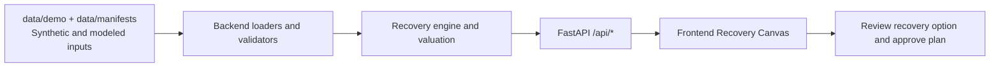

# Rollout Planner

A planning and recovery analysis tool for residential battery installers like Base. It takes an installation plan plus a disruption (a crew out, reduced capacity, a readiness change, or an appointment change), finds the best recovery, and explains which commitments are at risk and why.

It is not a customer booking tool. It does not pick appointments or send anything to customers.

Status: the backend works end to end. It covers data loading, input checks, battery valuation, the CP-SAT planner, the independent validator, baselines, diffs, counterfactuals, and the API. The UI is in progress. Spec: [`docs/SPEC.md`](docs/SPEC.md).

## Quick start

Needs `uv`, `make`, and bash (macOS, Linux, WSL, or Git Bash on Windows). The UI also needs `pnpm`.

"Verified" means the command ran and passed on 2026-09-26 on Windows with Git Bash. macOS and Linux are not verified.

| Command                                              | What it does                                                                                                                  | Status                                                        |
| ---------------------------------------------------- | ----------------------------------------------------------------------------------------------------------------------------- | ------------------------------------------------------------- |
| `make setup`                                         | Install Python deps. Installs frontend deps once `frontend/package.json` exists                                               | verified (backend part)                                       |
| `make api`                                           | API on http://localhost:8000. Builds every value table in the background. `GET /api/health` reports `values: ready` when done | verified                                                      |
| `make check-contracts`                               | Contract tests plus a check that `contracts/openapi.json` is current                                                          | verified                                                      |
| `make check-a`                                       | Data, valuation, and validation lint/tests                                                                                    | verified                                                      |
| `make check-b`                                       | Planning, baselines, compare, and API lint/tests                                                                              | verified                                                      |
| `make mocks`                                         | Re-record the UI mock responses from the in-process API                                                                       | verified                                                      |
| `make types`                                         | Write `contracts/openapi.json`, then generate `frontend/src/api/generated.ts`                                                 | OpenAPI half verified. The TypeScript half needs the frontend |
| `make check`                                         | All of the above plus `check-c`                                                                                               | needs the frontend                                            |
| `make dev`, `make dev-live`, `make e2e`, `make demo` | UI commands                                                                                                                   | need the frontend                                             |

Try the API without the UI:

```bash
make api
curl -s localhost:8000/api/scenarios
curl -s -X POST localhost:8000/api/recovery/options -H 'content-type: application/json'   -d '{"scenario_id":"standard","revision":1,"disruption":[{"kind":"remove_crew_day","crew_id":"BA","date":"2018-06-07"}]}'
```

Every error is an `ApiError` with `code` and `message`. The first cold start builds the standard value table in the background, which took 46 s on the test laptop.

## Tech stack

- Backend: Python 3.13, FastAPI, Pydantic, OR-Tools CP-SAT, HiGHS (`scipy.optimize.milp`), `uv`
- Frontend: React, TypeScript, Vite, Vitest, Playwright, MSW
- Contracts and tooling: OpenAPI (`contracts/openapi.json`), generated TypeScript client (`frontend/src/api/generated.ts`), Make

## Architecture diagram



## How to reproduce the demo

1. Copy both sample env files.
2. Start backend and frontend.
3. Open the UI and run the disruption flow.

```bash
cp .env.example .env
cp frontend/.env.example frontend/.env
make setup
make dev-live
```

Open the app at `http://localhost:5173`.

- Backend env vars (`.env`):
  - `DEMO_DIR=data/demo`
  - `API_PORT=8000`
  - `SOLVE_TIME_LIMIT_S=15`
- Frontend env vars (`frontend/.env`) for the live demo path above:
  - Set `VITE_API_MODE=live` to proxy `/api` to `localhost:8000`
- Optional mock-only run:
  - Set `VITE_API_MODE=mock`
  - Run `make dev` instead of `make dev-live`
- API keys: none are required for this repo. Data is local files plus recorded mocks.
- Demo script: [`docs/DEMO.md`](docs/DEMO.md)

## Datasets and provenance

- `data/demo/tiny`: synthetic hand-built fixture with expected outputs in `data/demo/tiny/expected/`.
- `data/demo/standard`: synthetic scenario for larger-scale tests.
- `data/demo/standard_real`: mixed dataset for realism tests. Provenance is documented per file in `data/manifests/*.json`.
- `data/manifests/ercot_np6_785_2018.json`: ERCOT 2018 historical prices used as hindsight modeled value input.
- `data/manifests/resstock_amy2018_tx_100.json`: synthetic building sample derived from NREL ResStock.
- `data/manifests/hcad_parcels.json`: parcel-based candidate site source used for modeled locations.

## Layout

```text
backend/app/contracts   frozen Pydantic models (source of truth for types)
backend/app/data        loading, input checks, fixtures, data prep
backend/app/valuation   battery MILP, value table
backend/app/validate    independent plan validator
backend/app/planning    CP-SAT model, strict and recovery modes
backend/app/baselines   EDF and nearest-cluster baselines
backend/app/compare     plan diffs
backend/app/api         FastAPI app
frontend/               React app, MSW mocks, Playwright
data/demo/tiny          hand-built 6-job fixture with expected results
contracts/              generated openapi.json and the change log
lanes/                  archived and in-progress implementation lane notes
docs/                   spec, decisions, contracts, design, demo script
```

## Data honesty

All tiny and standard inputs are synthetic until a manifest in `data/manifests/` says otherwise. The UI labels synthetic data. Historical-price value is a hindsight benchmark, not a forecast.

## Assumptions and interpretation

This is a hackathon demonstration built from representative inputs. Crew counts, job durations, wages, customer portfolios, deadlines, inventory receipts, intervention costs, and disruption effects are illustrative demo numbers unless a manifest or source statement explicitly identifies an observed input. They are not Base operating data, customer commitments, quotes, forecasts, or recommended commercial rates. Scenario-specific values live in each `data/demo/<scenario_id>/scenario.yaml`; those files take precedence over the defaults summarized here.

### What the displayed dollar amount means

The UI calls `net_impact_usd` **Adjusted cost vs original plan**. It is the estimated incremental effect of an option relative to the original, undisrupted schedule:

```text
adjusted cost = overtime labor
              + temporary crew-days
              + lost modeled battery operating value
              + incremental travel
              + deadline penalties
              + customer rescheduling
```

A positive amount is an estimated added cost and is shown in red. A negative amount is an estimated reduction relative to the original plan and is shown in green. Zero is neutral. “Lowest adjusted cost” only compares the feasible, validated options returned by the bounded recovery search; it is not a business recommendation or a proof that no other intervention exists.

Default representative economics:

| Input                      |         Demo default | Interpretation                                                          |
| -------------------------- | -------------------: | ----------------------------------------------------------------------- |
| Hourly wage                |   $28.33/person-hour | BLS OEWS May 2023 Houston mean for SOC 47-2111; not Base payroll data   |
| Crew size                  |             2 people | Assumed staffing                                                        |
| Overtime multiplier        |                 1.5× | Illustrative premium; not a payroll determination                       |
| Maximum added time         | 120 minutes/crew-day | Demo search limit                                                       |
| Temporary crew-day         |              $453.28 | 8 hours × 2 people × $28.33, with no agency markup or benefits load     |
| Travel cost                |            $0/minute | Disabled because the project has no defensible incremental mileage rate |
| Missed-deadline penalty    |              $0/home | Disabled because no contractual penalty was supplied                    |
| Customer rescheduling cost |          $0/customer | Disabled because no measured contact cost was supplied                  |

Operators can override these figures in the UI. Overrides reprice solved plans; they do not change the schedule unless the planner is run again with different planning inputs. Existing-roster labor is treated as already committed, so the comparison does not claim payroll savings when work is deferred.

### Portfolio and operations assumptions

- Homes and appointments are synthetic. Parcel-derived coordinates are candidate locations, not confirmed customers or historical installations.
- Scheduling uses `America/Chicago`. Energy intervals use timezone-aware UTC timestamps.
- A home may require an electrical `install` visit and a later `battery_day` visit. The battery visit must follow the install by the configured minimum number of business days. The customer deadline and battery inventory consumption apply to the battery visit.
- Readiness dates, appointment dates, locks, crew skills, allowed clusters, daily minutes, and dated inventory receipts are hard constraints. Recovery never silently breaks them.
- Each crew-day works in at most one cluster. Travel is a fixed cluster allowance included in daily capacity; the planner does not calculate routes, stop order, mileage, traffic, or drive-time variability.
- Inventory rows are dated incoming receipts. The model does not infer emergency procurement, substitutions, partial kits, or unrecorded stock.
- Crew availability, durations, deadlines, geographic spread, inventory cadence, weather effects, and disruption payloads are scenario parameters chosen to exercise representative planner behavior. They are not forecasts of Base operations.
- A UI approval records the selected plan in this application only. It does not dispatch crews, reserve inventory, update a CRM, contact customers, or write to an external production system.

### Planning and recovery assumptions

- Strict planning requires every visit to be scheduled legally and by its deadline. Recovery may use the configured overflow horizon and may return late or unscheduled work when no fully on-time plan exists.
- Recovery priorities are applied in order: minimize late or unscheduled homes; minimize total delay; maximize modeled operating value; minimize changed appointments; then minimize travel allowance. A lower-priority gain never overrides a higher-priority commitment outcome.
- Unscheduled work receives a configured delay penalty larger than any possible in-horizon lateness so that the solver prefers a legal late assignment over dropping the work.
- Returned plans are checked independently for skills, clusters, capacity, inventory, readiness, appointments, locks, and two-visit precedence before the UI permits approval.
- Recovery options come from a deterministic, bounded candidate search over actions such as rebalancing, overtime, and temporary crew-days. “Optimal” applies to the stated mathematical solve and candidate set, not every operational action a human could invent.
- Solve time limits, worker counts, objective policy, planning dates, overflow days, and deterministic seeds are scenario configuration. A feasible incumbent may be shown as “best found, not proven” if the solver reaches its limit before proving optimality.

### Battery-value assumptions

- Battery operating value is a modeled gross operating-margin benchmark based on 2018 ERCOT historical settlement prices. It is hindsight, not a price forecast, customer bill estimate, guaranteed revenue, profit, savings, ROI, or lifetime value.
- The battery model honors configured capacity, reserve, charge/discharge limits, and efficiencies; it prevents simultaneous charging and discharging. Initial and terminal energy both equal the reserve so the calculation does not monetize free starting energy.
- Operation starts after the battery-day visit and configured qualification lag and ends at a common evaluation date. The qualification lag is a scenario assumption, not evidence of actual market onboarding time.
- The default unrestricted-export benchmark values energy at the selected load-zone price. A scenario may instead use load-limited sensitivity with representative ResStock demand; those profiles are archetypes, not measured household consumption.
- Hardware cost, financing, degradation, taxes, retail tariffs, acquisition cost, installation revenue, market fees, outage value, and the cost of establishing the reserve are outside the valuation unless explicitly added to a scenario.
- Historical energy data may be observed while the installation portfolio and operational impact remain synthetic. The UI and narrative must state that distinction explicitly.

### Evidence boundaries

The project demonstrates deterministic planning, constraint validation, disruption analysis, and scenario comparison. It does not establish customer demand, operational savings achieved by Base, production reliability, or the commercial value of deployment. Results should be described as **synthetic**, **modeled**, **assumed**, or **observed** according to their manifests and scenario metadata.

## Known limitations

- UI status is in progress. Live API coverage depends on branch state. If a screen is not live-wired yet, use mock mode (`VITE_API_MODE=mock` and `make dev`).
- Travel is a fixed allowance per crew-day. The planner does not optimize routes or stop order.
- Weather replay is parked in `lanes/_parked/weather` and is not in the main demo flow.
- Live external feeds and autonomous approval are out of scope in this build.

## Next steps

- Complete live API wiring for every Recovery Canvas screen so mock mode is only needed for offline demos.
- Expand integration and e2e coverage for recovery options and approval.
- Add more documented observed datasets and keep synthetic versus modeled labels in UI and docs.
- Improve recovery comparisons with clearer risk and commitment impact summaries.

## Team workflow notes

Internal team and agent orchestration notes are in [`docs/TEAM_AGENT_WORKFLOW.md`](docs/TEAM_AGENT_WORKFLOW.md).
