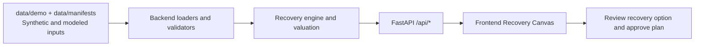

# Rollout Planner

A planning and recovery analysis tool for residential battery installers like Base. It takes an installation plan plus a disruption (a crew out, reduced capacity, a readiness change, or an appointment change), finds the best recovery, and explains which commitments are at risk and why.

It is not a customer booking tool. It does not pick appointments or send anything to customers.

Status: the backend works end to end. It covers data loading, input checks, battery valuation, the CP-SAT planner, the independent validator, baselines, diffs, counterfactuals, and the API. The UI is in progress. Spec: [`docs/SPEC.md`](docs/SPEC.md).

## Quick start

Needs `uv`, `make`, and bash (macOS, Linux, WSL, or Git Bash on Windows). The UI also needs `pnpm`.

"Verified" means the command ran and passed on 2026-09-26 on Windows with Git Bash. macOS and Linux are not verified.

| Command | What it does | Status |
|---|---|---|
| `make setup` | Install Python deps. Installs frontend deps once `frontend/package.json` exists | verified (backend part) |
| `make api` | API on http://localhost:8000. Builds every value table in the background. `GET /api/health` reports `values: ready` when done | verified |
| `make check-contracts` | Contract tests plus a check that `contracts/openapi.json` is current | verified |
| `make check-a` | Lane A lint and tests | verified |
| `make check-b` | Lane B lint and tests | verified |
| `make mocks` | Re-record the UI mock responses from the in-process API | verified |
| `make types` | Write `contracts/openapi.json`, then generate `frontend/src/api/generated.ts` | OpenAPI half verified. The TypeScript half needs the frontend |
| `make check` | All of the above plus `check-c` | needs the frontend |
| `make dev`, `make dev-live`, `make e2e`, `make demo` | UI commands | need the frontend |

Try the API without the UI:

```bash
make api
curl -s localhost:8000/api/scenarios
curl -s -X POST localhost:8000/api/recovery/options -H 'content-type: application/json'   -d '{"scenario_id":"standard","revision":1,"disruption":[{"kind":"remove_crew_day","crew_id":"BA","date":"2018-06-07"}]}'
```

Every error is an `ApiError` with `code` and `message`. The first cold start builds the standard value table in the background, which took 46 s on the test laptop.

## Tech stack

- Backend: Python 3.13, FastAPI, Pydantic, OR-Tools CP-SAT, HiGHS (`scipy.optimize.milp`), `uv`
- Frontend: React, TypeScript, Vite, Vitest, Playwright, MSW
- Contracts and tooling: OpenAPI (`contracts/openapi.json`), generated TypeScript client (`frontend/src/api/generated.ts`), Make

## Architecture diagram



## How to reproduce the demo

1. Copy both sample env files.
2. Start backend and frontend.
3. Open the UI and run the disruption flow.

```bash
cp .env.example .env
cp frontend/.env.example frontend/.env
make setup
make dev-live
```

- Backend env vars (`.env`):
  - `DEMO_DIR=data/demo`
  - `API_PORT=8000`
  - `SOLVE_TIME_LIMIT_S=15`
- Frontend env vars (`frontend/.env`):
  - Set `VITE_API_MODE=mock` for recorded mocks, or set `VITE_API_MODE=live` to proxy `/api` to `localhost:8000`
- API keys: none are required for this repo. Data is local files plus recorded mocks.
- Demo script: [`docs/DEMO.md`](docs/DEMO.md)

## Datasets and provenance

- `data/demo/tiny`: synthetic hand-built fixture with expected outputs in `data/demo/tiny/expected/`.
- `data/demo/standard`: synthetic scenario for larger-scale tests.
- `data/demo/standard_real`: mixed dataset for realism tests. Provenance is documented per file in `data/manifests/*.json`.
- `data/manifests/ercot_np6_785_2018.json`: ERCOT 2018 historical prices used as hindsight modeled value input.
- `data/manifests/resstock_amy2018_tx_100.json`: synthetic building sample derived from NREL ResStock.
- `data/manifests/hcad_parcels.json`: parcel-based candidate site source used for modeled locations.

## Start a lane

Three lanes build in parallel: R-engine (recovery engine), C-canvas (recovery canvas UI), and H-hardening (makes the flow demo-safe: errors, stub and validation honesty, e2e, freeze script). Weather replay is a parked nice-to-have (`lanes/_parked/weather`). Each teammate runs one lane in their own clone or worktree, with any coding agent or by hand. The rules live in `AGENTS.md` and `CLAUDE.md`. Each lane's state and next step live in `lanes/<lane>/PROGRESS.md`.

```bash
git switch lane/R-engine      # or lane/C-canvas, lane/H-hardening
./lanes/R-engine/init.sh
```

Then give your agent one line:

```text
Read AGENTS.md and CLAUDE.md, then lanes/R-engine/PROGRESS.md, and continue from there.
```

- Stop an agent: `touch AGENT_STOP`. Resume: `rm AGENT_STOP`.
- Redirect an agent: write a note to `lanes/<lane>/STEER.md` or `STEER.md`.
- The day 1 lanes (A, B, C) are archived in `lanes/_archive/`.

## Layout

```text
backend/app/contracts   frozen Pydantic models (source of truth for types)
backend/app/data        lane A: loading, input checks, fixtures, data prep
backend/app/valuation   lane A: battery MILP, value table
backend/app/validate    lane A: independent plan validator
backend/app/planning    lane B: CP-SAT model, strict and recovery modes
backend/app/baselines   lane B: EDF and nearest-cluster baselines
backend/app/compare     lane B: plan diffs
backend/app/api         lane B: FastAPI app
frontend/               lane C: React app, MSW mocks, Playwright
data/demo/tiny          hand-built 6-job fixture with expected results
contracts/              generated openapi.json and the change log
lanes/                  today's lane briefs, feature lists, progress notes; lanes/_archive holds day 1
docs/                   spec, decisions, contracts, design, demo script
```

## Data honesty

All tiny and standard inputs are synthetic until a manifest in `data/manifests/` says otherwise. The UI labels synthetic data. Historical-price value is a hindsight benchmark, not a forecast.

## Known limitations

- UI status is in progress. Some flows still rely on recorded mocks.
- Travel is a fixed allowance per crew-day. The planner does not optimize routes or stop order.
- Weather replay is parked in `lanes/_parked/weather` and is not in the main demo flow.
- Live external feeds and autonomous approval are out of scope in this build.

## Next steps

- Complete the live API path across the full Recovery Canvas flow and keep mock parity tests.
- Expand integration and e2e coverage for recovery options and approval.
- Add more documented observed datasets and keep synthetic versus modeled labels in UI and docs.
- Improve recovery comparisons with clearer risk and commitment impact summaries.
